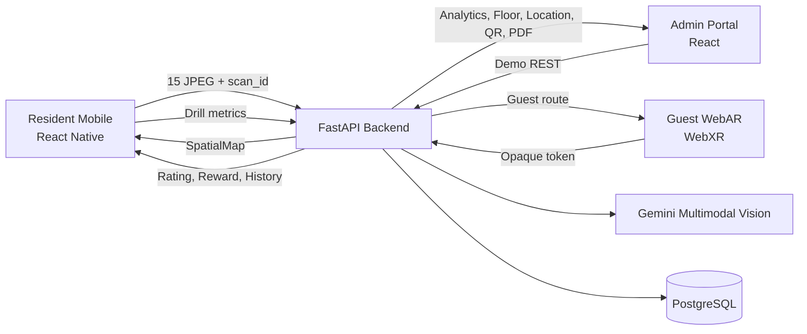
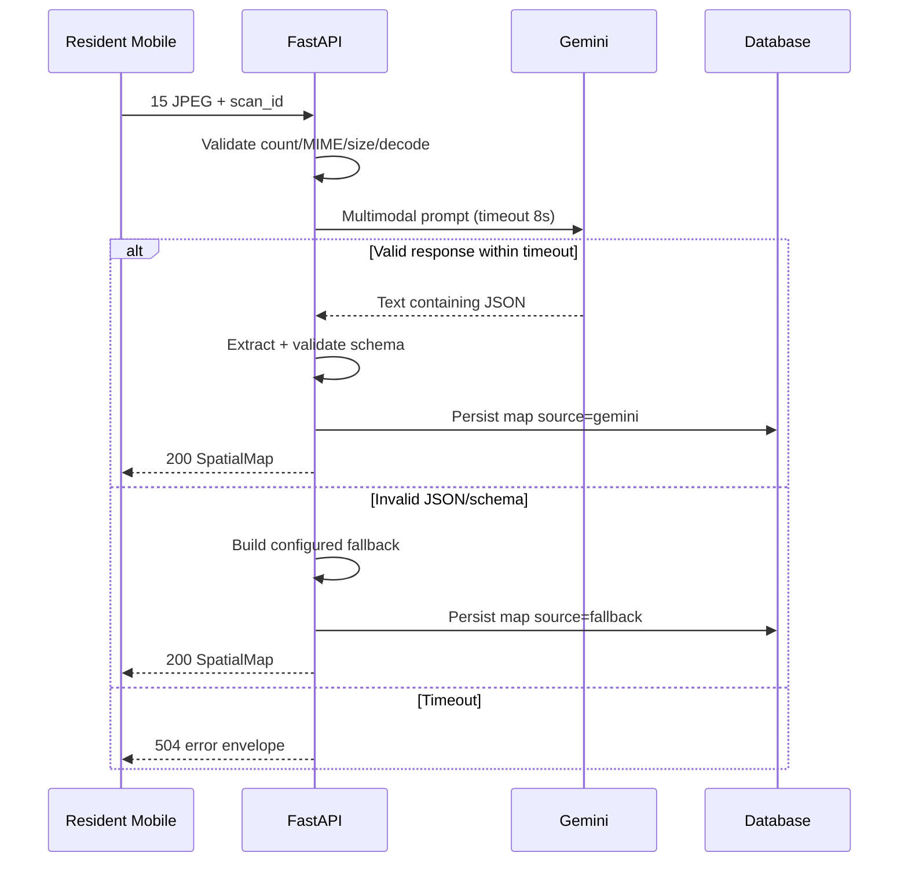
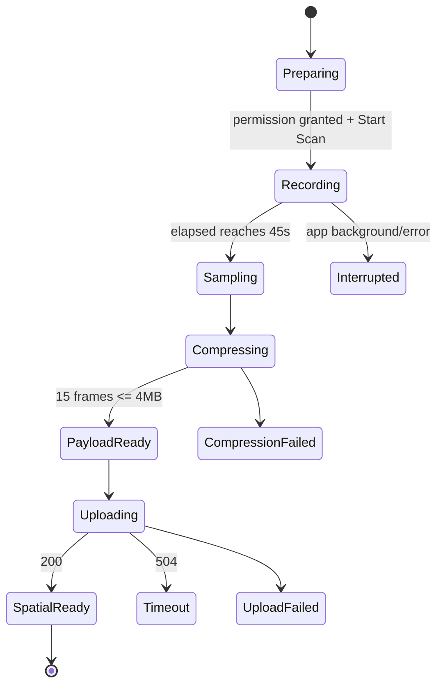
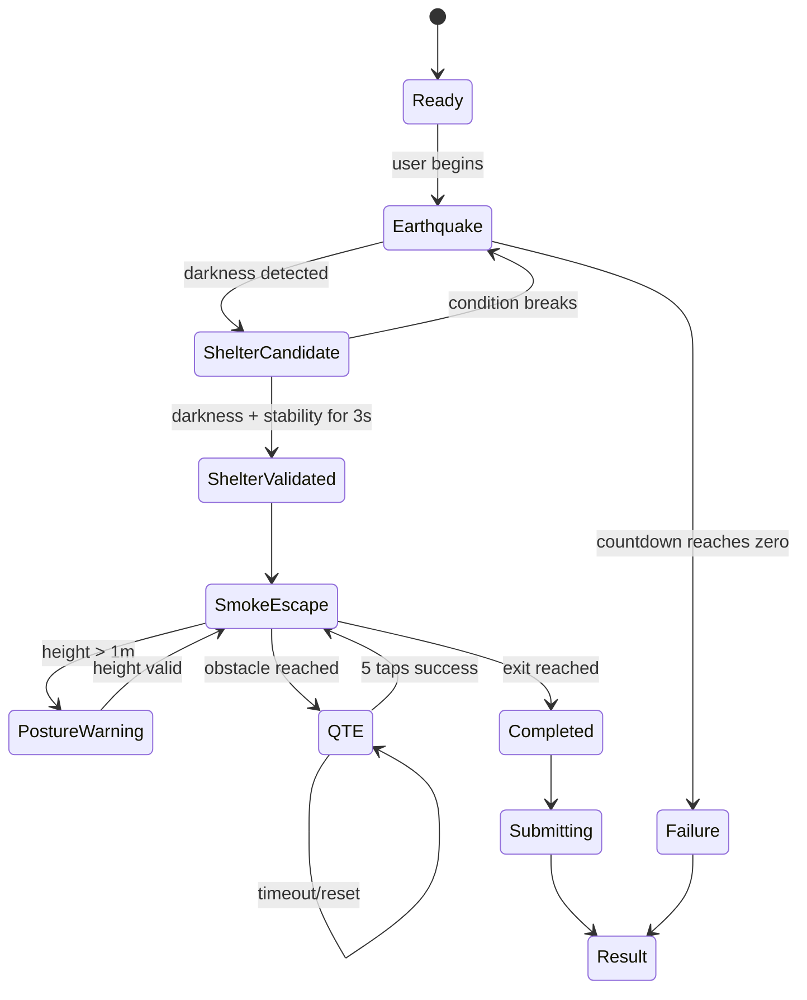

# Arsitektur Sistem, Data, dan Integrasi — 3MINUTES

## 1. Tujuan arsitektur

Arsitektur harus memungkinkan empat anggota bekerja paralel, mempertahankan seluruh fitur, dan menyatukan hasil melalui contract yang stabil. Prioritas desain:

1. End-to-end vertical slice secepat mungkin.
2. Source of truth tunggal untuk data bisnis.
3. Batas domain jelas.
4. Fallback yang tidak mengubah contract.
5. Testability untuk sensor, AI, timing, dan security.
6. Performance sesuai acceptance.

## 2. Context diagram



## 3. Deployment units

| Unit | Domain | Runtime | Tanggung jawab |
|---|---|---|---|
| Resident Mobile | 1 + 2 | React Native | UI resident, scan, AR drill, sensors |
| API | 3 | FastAPI | AI orchestration, data, rating, analytics, QR, PDF |
| Admin Portal | 4 | React SPA | B2B dashboard dan management UI |
| Guest WebAR | 4 | WebXR web app | Route AR tanpa login |
| PostgreSQL | 3 | Database | Persistent source of truth |

## 4. Domain boundaries

### Domain 1

Boleh menulis:

- Mobile navigation.
- Resident UI.
- Scan pipeline.
- Mobile API adapters.
- Result/reward/history presentation.

Tidak boleh menulis:

- Rating formula.
- Reward eligibility.
- QR token.
- Building analytics.
- Sensor fusion internal Domain 2.

### Domain 2

Boleh menulis:

- Drill state machine.
- AR rendering.
- Sensor adapters.
- Validation.
- Drill metrics.

Tidak boleh menulis:

- Resident scan.
- Backend calls selain melalui adapter yang disepakati.
- Rating/reward.
- Admin/guest.

### Domain 3

Boleh menulis:

- Semua backend endpoint dan business rules.
- Database.
- Gemini orchestration.
- Scheduled job.
- File generation.

Tidak boleh menulis:

- Frontend presentation.
- Device sensor calculation.

### Domain 4

Boleh menulis:

- Admin UI.
- Guest WebAR UI/rendering.
- API consumer.

Tidak boleh menulis:

- Analytics aggregation.
- QR cryptography.
- PDF generation.
- Rating.

## 5. Source of truth

| Data | Source |
|---|---|
| Temporary recorded video/frame | Device Domain 1 |
| Spatial map | Backend DB Domain 3 |
| Live sensor stream | Device Domain 2 |
| Drill metrics final | Device Domain 2, divalidasi backend |
| Drill history | Backend DB |
| Safety rating/tier | Backend DB |
| Reward eligibility | Backend DB |
| Building/floor/location | Backend DB |
| Analytics | Backend aggregation |
| QR token mapping | Backend DB |
| Guest render state | Guest browser |

## 6. Shared identifiers

Gunakan string/UUID opaque:

- `installation_id`
- `scan_id`
- `spatial_map_id`
- `drill_id`
- `building_id`
- `floor_plan_id`
- `location_id`
- `location_ref`
- `qr_token_id`

`installationId` adalah UUID anonim yang dibuat dan disimpan pada perangkat untuk persistensi demo, bukan mekanisme autentikasi. `DEMO_BUILDING_ID` berasal dari server; client tidak boleh menjadikannya otoritas. `scanId` dibuat client dan harus unik.

## 7. Coordinate convention

SpatialMap menggunakan sistem koordinat relatif:

- Origin pertama: center frame pertama `(0,0,0)`.
- `x`: kanan positif.
- `y`: atas positif.
- `z`: arah depan/belakang sesuai convention provider yang dibekukan Architect.
- Unit: meter relatif.

Karena provider AR dapat mempunyai coordinate convention berbeda, Domain 2 wajib memiliki normalization layer:

```text
Backend SpatialMap coordinate
        ↓
SpatialCoordinateAdapter
        ↓
AR provider coordinate
```

Tidak boleh mengubah raw SpatialMap di UI secara ad hoc.

## 8. Shared data contracts

### 8.1 Vector3

```json
{
  "x": 0.0,
  "y": 0.0,
  "z": 0.0
}
```

### 8.2 Spatial element

```json
{
  "id": "safe-1",
  "type": "SAFE_ZONE",
  "label": "sturdy_table",
  "position": { "x": 1.2, "y": 0.0, "z": -2.4 },
  "confidence": 0.91
}
```

`confidence` dapat optional apabila Gemini/fallback tidak menyediakannya. Optionality harus sama pada TypeScript dan Pydantic.

### 8.3 SpatialMap

```json
{
  "scanId": "scan-demo-001",
  "origin": { "x": 0, "y": 0, "z": 0 },
  "safeZones": [],
  "hazardZones": [],
  "exitPoints": [],
  "source": "gemini",
  "createdAt": "2026-07-16T00:00:00Z"
}
```

`source` enum:

- `gemini`
- `fallback`

At least one safe zone dan one exit point harus tersedia agar drill dapat berjalan. Bila AI tidak menghasilkan minimum tersebut, fallback diterapkan.

### 8.4 Drill metrics

```json
{
  "scanId": "scan-demo-001",
  "reactionTimeMs": 8420,
  "evacuationTimeMs": 61240,
  "postureScorePercentage": 91,
  "completedAtDevice": "2026-07-16T00:00:00Z"
}
```

Backend menggunakan server receipt time untuk anti-abuse dan tidak mempercayai timestamp device sebagai sumber eligibility.

### 8.5 Drill result

```json
{
  "drillId": "drill-demo-001",
  "accepted": true,
  "rewardEligible": true,
  "safetyRating": 92,
  "tier": "Platinum",
  "recordedAt": "2026-07-16T00:00:01Z"
}
```

### 8.6 Analytics

```json
{
  "buildingId": "building-demo-001",
  "participationRatePercentage": 85.0,
  "averageShelterTimeMs": 12100,
  "escapeRouteTrends": [
    {
      "period": "2026-W29",
      "averageEvacuationTimeMs": 64000
    }
  ],
  "heatmapCells": [
    {
      "locationRef": "floor-4-room-402",
      "failureRatePercentage": 15.0,
      "averageEvacuationTimeMs": 73200,
      "sampleCount": 20
    }
  ]
}
```

### 8.7 Guest route

```json
{
  "locationRef": "floor-4-room-402",
  "origin": { "x": 0, "y": 0, "z": 0 },
  "routePoints": [
    { "x": 0, "y": 0, "z": -1.5 },
    { "x": 1.2, "y": 0, "z": -3.0 }
  ],
  "hazardPoints": [],
  "safeZones": [],
  "exitPoint": { "x": 2.1, "y": 0, "z": -5.0 }
}
```

### 8.8 Navigation accessibility contract

```ts
type AccessibilityMode = 'VISUAL_ONLY' | 'VISUAL_AND_AUDIO' | 'AUDIO_PRIMARY';

type GuidanceEvent = {
  action:
    | 'GO_STRAIGHT'
    | 'TURN_LEFT'
    | 'TURN_RIGHT'
    | 'AVOID_LEFT'
    | 'AVOID_RIGHT'
    | 'STAY_LOW'
    | 'SAFE_ZONE_LEFT'
    | 'SAFE_ZONE_RIGHT'
    | 'EXIT_AHEAD'
    | 'ARRIVED';
  distanceMeters?: number;
  priority: 'NORMAL' | 'CRITICAL';
};
```

Resident dan Guest menghitung event dari posisi/heading, waypoint aktif, jarak belokan, hazard, safe zone, exit, posture, dan state simulasi. Event adalah tindakan semantik; masing-masing client mengubahnya menjadi bahasa Indonesia yang jelas. `AUDIO_PRIMARY` harus mengucapkan semua event `CRITICAL` dan tidak boleh bergantung pada UI visual.

Audio policy: instruksi `CRITICAL` menginterupsi atau menurunkan volume audio ambience/alarm sementara; event identik harus di-debounce agar tidak berulang setiap frame.

## 9. API conventions

Base path:

```text
/api
```

Success menggunakan JSON kecuali QR/PDF file download.

Error envelope:

```json
{
  "error": {
    "code": "SPATIAL_AI_TIMEOUT",
    "message": "Analisis ruang melewati batas waktu.",
    "details": null
  }
}
```

Aturan:

- `code` stabil dan machine-readable.
- `message` aman untuk user/log.
- `details` tidak memaparkan secret/stack.

## 10. Endpoint contract

### 10.1 Spatial scan

```text
POST /api/scans/spatial-map
Content-Type: multipart/form-data
Idempotency-Key: <scanId>

scanId: string
installationId: string
images: exactly 15 JPEG
floorPlan: optional file
locationId: string
```

Responses:

- `200`: SpatialMap.
- `400`: file count/format/payload invalid.
- `409`: duplicate conflict yang tidak idempotent.
- `504`: Gemini hard timeout (`AI_TIMEOUT`); mobile may continue with local fallback.
- `500`: unexpected server error.

Invalid Gemini JSON bukan 500 bila fallback berhasil.

### 10.2 Resident home

```text
GET /api/resident/home
?installationId=...
```

Response mencakup profile, location status, safety rating, tier, reward summary, dan last drill summary.

### 10.3 Drill completion

```text
POST /api/drills/{drillId}/complete
Content-Type: application/json
```

Request: DrillMetrics.

Response: DrillResult.

### 10.4 Rewards

```text
GET /api/resident/rewards?installationId=...
```

### 10.5 History

```text
GET /api/resident/history?installationId=...&limit=...&cursor=...
```

### 10.6 Admin analytics

```text
GET /api/admin/analytics
```

Backend selalu memakai `DEMO_BUILDING_ID` dari environment dan mengabaikan scope building dari client.

### 10.7 Floor plans

```text
POST /api/admin/floor-plans
GET /api/admin/floor-plans
GET /api/admin/floor-plans/{floor_plan_id}
```

### 10.8 Locations

```text
POST /api/admin/locations
GET /api/admin/locations
```

### 10.9 Generate QR

```text
POST /api/admin/locations/{locationId}/rescue-qr
```

Response JSON:

```json
{
  "locationId": "loc-1",
  "guestUrl": "https://guest.example/r/opaque-token",
  "qrSvgUrl": "/api/admin/qr/...svg",
  "qrPngUrl": "/api/admin/qr/...png"
}
```

### 10.10 Guest route

```text
GET /api/guest/rescue/{token}
```

No login.

Responses:

- `200`: GuestRoute.
- `404` atau `410`: invalid/expired sesuai kebijakan Architect.

### 10.11 Compliance PDF

```text
POST /api/admin/compliance-reports
GET /api/admin/compliance-reports/{reportId}
GET /api/admin/compliance-reports/{reportId}/download
```

Response `application/pdf`.

## 11. Anonymous demo identity dan scope

- Tidak ada login, auth, JWT, session, password, atau akun pengguna.
- Resident memakai `installationId` anonim yang dibuat sekali di perangkat; backend hanya memakainya untuk persistensi profile/history demo.
- Endpoint admin selalu memakai `DEMO_BUILDING_ID` server-side.
- Guest memakai opaque QR token untuk resolve lokasi, bukan autentikasi. Token tidak memuat plaintext coordinate dan dapat memiliki expiry.

## 12. Database design

### 12.1 organizations

```text
id PK
name
created_at
updated_at
```

### 12.2 buildings

```text
id PK
organization_id FK
name
status
created_at
updated_at
```

### 12.3 device_profiles

```text
installation_id PK
safety_rating
tier
last_drill_at
last_decay_week
created_at
updated_at
```

### 12.4 spatial_scans

```text
id PK
scan_id unique
installation_id
building_id FK
status uploaded|processing|completed|fallback|failed
frame_count
payload_bytes
created_at
completed_at
```

Temporary image retention harus minimal sesuai kebutuhan processing. Jangan menyimpan seluruh image tanpa kebutuhan.

### 12.5 spatial_maps

```text
id PK
scan_id FK unique
origin_json
safe_zones_json
hazard_zones_json
exit_points_json
source gemini|fallback
created_at
```

Untuk hackathon, JSON columns dapat mempercepat implementasi. Index tetap dibuat pada `scan_id` dan owner relation.

### 12.6 drills

```text
id PK
installation_id
scan_id FK
building_id FK
reaction_time_ms
 evacuation_time_ms
posture_score_percentage
accepted
reward_eligible
safety_rating_after
tier_after
created_at
```

### 12.7 drill_metrics

```text
id PK
drill_id FK unique
reaction_time_ms
evacuation_time_ms
posture_score_percentage
completed_at_device
received_at
```

### 12.8 reward_issuances

```text
id PK
installation_id
drill_id FK
cycle_started_at
issued_at
unique constraint/transaction guard untuk rolling eligibility policy
```

Karena rolling seven-day window tidak selalu cocok dengan calendar week uniqueness, service harus memeriksa latest issuance di dalam transaction.

### 12.9 floor_plans

```text
id PK
building_id FK
name
file_url/path
metadata_json
created_at
```

### 12.10 locations

```text
id PK
building_id FK
floor_plan_id FK
location_ref
label
origin_json
route_points_json
exit_point_json
created_at
unique(building_id, location_ref)
```

### 12.11 qr_tokens

```text
id PK
token_hash unique
location_id FK
created_at
revoked_at nullable
```

Store hash token bila memungkinkan. URL membawa raw opaque token; backend membandingkan hash.

### 12.12 compliance_reports

```text
id PK
building_id FK
period_from
period_to
file_url/path
generated_at
```

## 13. Spatial AI pipeline



### Gemini system prompt requirements

- Return only JSON.
- Use required keys.
- Identify safe, hazard, exit.
- Use relative coordinate.
- Do not include markdown fence.
- Do not invent unsupported categories.

Backend tetap harus robust terhadap markdown fence atau extra text.

## 14. Scan pipeline mobile



Sampling harus berdasarkan target timestamp, bukan bergantung pada callback frame yang mungkin drift. Domain 1 mencatat timestamp frame yang dipilih.

## 15. Drill state machine



## 16. Shelter sensor fusion

Validation bukan satu sensor tunggal.

Candidate conditions:

- Ambient light `< 10 lux`, bila sensor tersedia.
- Camera mean brightness berada di bawah threshold yang dikalibrasi.
- Gyroscope variance `< 0.05` pada rolling window.
- Kondisi bertahan tiga detik.

Capability handling:

- Domain 2 mendeteksi sensor availability.
- Architect membekukan fallback capability yang masih mempertahankan validasi gabungan.
- Unsupported device tidak boleh diam-diam dianggap sukses.

## 17. Posture estimation

PRD menyebut linear accelerometer y-axis/height. Karena accelerometer tidak memberikan absolute height secara langsung, implementation harus memiliki abstraction `PostureEstimator` yang menghasilkan status:

```text
LOW
TOO_HIGH
UNKNOWN
```

Architect memilih estimator berdasarkan AR floor plane, device pose, atau sensor fusion yang tersedia pada provider. Acceptance tetap mengharuskan warning maksimal 100 ms setelah estimator mendeteksi `TOO_HIGH`.

## 18. Rating dan anti-abuse

Backend menerima metrics, lalu:

1. Validasi range.
2. Ambil latest reward issuance.
3. Tentukan `reward_eligible` berdasarkan rolling tujuh hari.
4. Hitung normalized reflex score.
5. Hitung normalized evacuation score.
6. Integrasikan posture score sesuai formula server.
7. Clamp 0–100.
8. Tentukan tier.
9. Simpan drill dan profile dalam transaction.
10. Bila eligible, simpan reward issuance.

Formula exact dan threshold harus menjadi config server dan diuji. Client hanya menampilkan hasil.

## 19. Rating decay MVP

Untuk MVP, decay dihitung saat profile dibaca atau drill baru disimpan. Bila tidak aktif lebih dari 30 hari, service menerapkan 5% per minggu yang belum tercatat lalu memperbarui profile. Tidak ada scheduler atau CLI job.

## 20. Analytics aggregation

Metrik:

- Participation rate.
- Average shelter time.
- Escape route trend.
- Heat-map per location.

Backend menggunakan indexed query pada `building_id`, `created_at`, dan `location_ref`/relation yang relevan. Portal tidak mengunduh seluruh raw drills untuk menghitung sendiri.

## 21. QR security

Flow:

1. Admin memilih location yang berada dalam building scope.
2. Backend membuat random opaque token.
3. Backend menyimpan token hash dan mapping location.
4. Guest URL dibangun.
5. QR SVG/PNG dibuat dari URL.
6. Guest route endpoint hash token dan resolve mapping.

SHA-256 truncation dapat digunakan pada representasi internal sesuai requirement, tetapi token harus tetap cukup opaque dan tidak memuat spatial coordinate mentah.

## 22. Compliance PDF

Backend mengumpulkan:

- Building metadata.
- Period.
- Participation.
- Average shelter time.
- Trend summary.
- Heat-map/table summary.
- Generated timestamp.

PDF dibuat server-side dan dikembalikan sebagai file. Portal hanya memicu dan mengunduh.

## 23. Guest WebAR architecture

```text
Landing shell
  -> Parse opaque token
  -> Resolve GuestRoute
  -> Request camera
  -> Initialize lightweight scene
  -> Establish marker/local origin
  -> Normalize route points
  -> Render arrow instances
  -> Update orientation per frame
```

Bundle budget:

- Hindari full admin dependencies.
- Pisahkan project/build.
- Tree-shake.
- Gunakan compressed small assets.
- Gunakan procedural arrow bila lebih kecil.
- Lazy-load hanya bila tidak merusak three-second readiness.

## 24. Debug minimum

Gunakan error message yang aman dan log lokal singkat saat development. Tidak ada requirement observability, correlation ID, atau telemetry pada MVP.

## 25. Test architecture

### Unit

- Sampling timestamp selection.
- Compression loop.
- Sensor rolling variance.
- Shelter state machine.
- QTE timing.
- Rating formula.
- Anti-abuse window.
- Decay idempotency.
- Token hash/resolve.

### Contract

- TypeScript fixture validation.
- Pydantic validation.
- API response snapshot/schema.

### Integration

- Mobile multipart ke backend.
- Backend AI mocked/fallback behavior.
- Domain 1 ke Domain 2 metrics handoff.
- Admin API memakai `DEMO_BUILDING_ID` server-side.
- QR ke guest route.

### E2E

- Resident physical device flow.
- Admin browser flow.
- Guest mobile browser flow.

### Performance

- Payload size.
- AI timeout.
- Sensor latency.
- Dashboard render.
- PDF generation/download.
- Guest bundle/startup/FPS.

## 26. Critical path

```text
Contracts + fixtures
  -> Backend spatial endpoint
  -> Mobile scan upload
  -> SpatialMap handoff
  -> AR drill metrics
  -> Backend rating
  -> Resident result/history

Building seed
  -> Floor/location
  -> QR token
  -> Guest route
  -> Guest WebAR

Drill seed/log
  -> Analytics
  -> Dashboard
  -> Compliance PDF
```

## 27. Integration checkpoints

### Checkpoint A

- All runtime boot.
- Contracts compile.
- Fixture flows render.

### Checkpoint B

- Mobile uploads real multipart.
- Backend returns real/fallback map.
- Admin loads real analytics.
- Guest resolves real token.

### Checkpoint C

- AR returns metrics.
- Rating persists.
- QR scan opens WebAR.
- PDF downloads.

### Checkpoint D

- Acceptance performance measured.
- Mock removed from final path.
- Rehearsal from clean seed.
